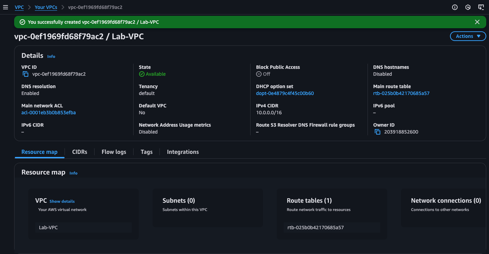
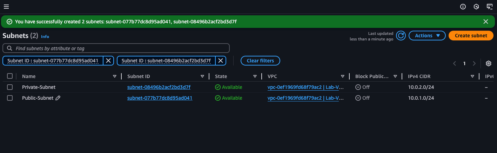
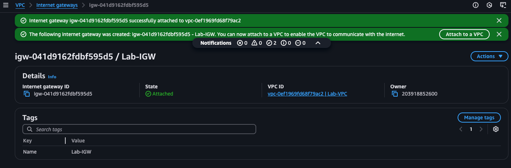

# Building a Custom VPC with Public & Private Subnets

## Objective: Stand up a secure AWS network that has:
- A public subnet for internet-facing resources
- A private subnet for backend resources
- An Internet Gateway (IGW) and NAT Gateway for controlled traffic

## Prerequisites
- An AWS account with Admin or VPC privileges
- AWS CLI configured
- A laptop with 3 hours set aside

## Architecture Overview
```vbnet
Internet  
   ↓  
[IGW]  
   ↓  
Public Route Table ── Public Subnet ── EC2 (Bastion/Web)  
   ↓ NAT Gateway  
Private Route Table ─ Private Subnet ─ EC2 (App/DB)
```

## Create A VPC
- Go to VPC → Your VPCs → Create VPC
    - Name: Lab-VPC
    - IPv4 CIDR: 10.0.0.0/16
    - Tenancy: Defualt



## Create Subnets
- Subnets → Create subnet
    - Select `Lab-VPC`, AZ `(select favorite location)`
    - CIDR block `10.0.1.0/24`, Name tag = `Public-Subnet`
    - Repeat for CIDR `10.0.2.0/24`, Name = `Private-Subnet`



## Setting up Internet Gateway (IGW)
- Internet Gateways → Create IGW, Name = `Lab-IGW`
- Select it → Actions → Attach to VPC → Lab-VPC



## Route Tables & Routes
### Public Route Table
- Route Tables → Create route table for `Lab-VPC`, Name = `Public-RT`
- Select it → Subnet Associations → Edit → Add Public-Subnet
- Under Routes, add:
    - Destination `0.0.0.0/0` → Target `Lab-IGW`

### Private Route Table + NAT Gateway
- Allocate Elastic IP:
    - EC2 → Network & Security → Elastic IPs → Allocate new address

- Create NAT Gateway:
    - VPC → NAT Gateways → Create NAT Gateway
    - Subnet = `Public-Subnet`, Elastic IP = your new EIP, Name = `Lab-NAT`

- Private RT:
    - Route Tables → Create for `Lab-VPC`, Name = `Private-RT`
    - Associate with `Private-Subnet`
    - Add route: `0.0.0.0/0` → Target = `Lab-NAT`

## Questions to Answer At The End of The Lab
- What is a VPC?
- What is a CIDR block?
- What is a Subnet?
- Difference Between a VPC & a Subnet?
- IPv4 and IPv6 CIDR block?
- While creating a Subnet, what is the importance of choosing an Availability Zone?
- When choosing a Subnet's IPv4 CIDR, why must it lie within the VPC's IPv4 CIDR block?
- What is the funtion of the IGW?
What is Route Tables and it's function in this setup?
- What is the essence of adding the 0.0.0.0/0 Destination Route to the Route Table?